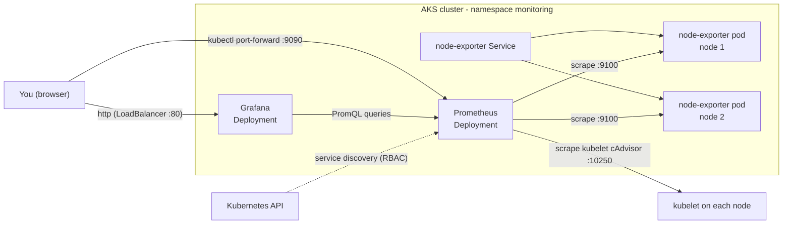

# Project 1: Prometheus, Grafana and Node Exporter on AKS

## Goal

Run a small, self-managed monitoring stack on Azure Kubernetes Service (AKS):

- **Prometheus** finds targets with Kubernetes service discovery and stores metrics.
- **Node Exporter** runs on every node (DaemonSet) and exposes CPU, memory, disk and network metrics.
- **Grafana** shows the metrics in dashboards. The Prometheus data source is provisioned automatically.

Everything is plain Kubernetes YAML, so you can see each moving part.

## Architecture



## Prerequisites

- An Azure subscription and the Azure CLI (`az login` done).
- `kubectl` 1.28 or newer.
- `openssl` (to generate the Grafana password).

## Files

| File | What it does |
| --- | --- |
| `create-aks.sh` | Creates a resource group and a 2-node AKS cluster, then loads the kubeconfig. |
| `namespace.yaml` | The `monitoring` namespace. |
| `prometheus-rbac.yaml` | ServiceAccount, ClusterRole and ClusterRoleBinding. Prometheus needs them to discover targets. |
| `prometheus-config.yaml` | ConfigMap with `prometheus.yml` (scrape jobs). |
| `prometheus.yaml` | Prometheus Deployment and a ClusterIP Service. |
| `nodeExporter.yaml` | Node Exporter DaemonSet (one pod per node). |
| `nodeExporter-service.yaml` | Service that Prometheus uses to find the Node Exporter pods. |
| `grafana-datasources.yaml` | ConfigMap that provisions the Prometheus data source in Grafana. |
| `grafana.yaml` | Grafana Deployment and a LoadBalancer Service. |
| `kustomization.yaml` | Lists all manifests so you can apply them with `kubectl apply -k .`. |

## Usage

### 1. Create the AKS cluster

The defaults are `test-rg`, `aksdemo18` and `centralindia`. Override them with environment variables.

```bash
RESOURCE_GROUP=test-rg AKS_NAME=aksdemo18 LOCATION=centralindia ./create-aks.sh
```

### 2. Create the monitoring namespace

```bash
kubectl apply -f namespace.yaml
```

### 3. Create the Grafana admin Secret

The password is never stored in Git. Generate a random one:

```bash
kubectl -n monitoring create secret generic grafana-admin \
  --from-literal=admin-user=admin \
  --from-literal=admin-password="$(openssl rand -base64 18)"
```

### 4. Deploy Prometheus

```bash
kubectl apply -f prometheus-rbac.yaml
kubectl apply -f prometheus-config.yaml
kubectl apply -f prometheus.yaml
```

Check the Prometheus deployment:

```bash
kubectl get pods -n monitoring
kubectl get svc -n monitoring
kubectl get configmap -n monitoring
```

### 5. Deploy Node Exporter

Apply **both** files. Without the Service, Prometheus finds no Node Exporter targets.

```bash
kubectl apply -f nodeExporter.yaml
kubectl apply -f nodeExporter-service.yaml
kubectl get daemonset -n monitoring
kubectl get pods -n monitoring -o wide
```

Node Exporter lets Prometheus and Grafana show real-time node metrics, such as CPU, memory, disk usage and network
stats, for each AKS worker node.

### 6. Deploy Grafana

```bash
kubectl apply -f grafana-datasources.yaml
kubectl apply -f grafana.yaml
kubectl get svc grafana -n monitoring
```

Wait until `EXTERNAL-IP` shows an address (1–2 minutes).

Shortcut: steps 2, 4, 5 and 6 in one command (create the Secret from step 3 first):

```bash
kubectl apply -f namespace.yaml
# create the grafana-admin Secret here (step 3)
kubectl apply -k .
```

## Access the UIs

### Grafana

The Grafana Service is a LoadBalancer. Open `http://<EXTERNAL-IP>` in your browser.

```bash
kubectl get svc grafana -n monitoring -o jsonpath='{.status.loadBalancer.ingress[0].ip}'; echo
```

- Username: `admin`
- Password: read it from the Secret:

```bash
kubectl -n monitoring get secret grafana-admin -o jsonpath='{.data.admin-password}' | base64 -d; echo
```

To limit who can reach the public IP, uncomment `loadBalancerSourceRanges` in `grafana.yaml`.

### Prometheus data source in Grafana

The data source is provisioned by `grafana-datasources.yaml`. You do not need to add it by hand.
You can check it in Grafana under **Connections → Data sources → Prometheus**. It uses this URL:

```text
http://prometheus.monitoring.svc.cluster.local:9090
```

### Prometheus

Prometheus has no login, so it is **not** exposed with a public LoadBalancer. Use port-forward:

```bash
kubectl -n monitoring port-forward svc/prometheus 9090:9090
```

Then open `http://localhost:9090`.

## Import pre-built dashboards in Grafana

### Node Exporter Full

1. In the Grafana UI, go to **Dashboards → New → Import**.
2. Enter dashboard ID `1860` (Node Exporter Full) and click **Load**.
3. Select **Prometheus** as the data source and click **Import**.

You now see metrics for all AKS nodes (CPU, memory, disk, network).

### Prometheus instance dashboard

To monitor Prometheus itself, import dashboard ID `3662` (Prometheus 2.0 Overview) the same way.

## Generate pod-level load (for AKS workloads)

Deploy a small test app and add replicas. The `kubernetes-cadvisor` scrape job collects CPU and memory per container.

```bash
kubectl create deployment load-demo --image=nginx:1.27
kubectl scale deployment load-demo --replicas=10
```

Port-forward to reach the app locally:

```bash
kubectl port-forward deploy/load-demo 8080:80
```

### Generate traffic

Use a load tool like `hey` or `ab`. This sends traffic for 5 minutes with 50 concurrent workers:

```bash
hey -z 5m -c 50 http://localhost:8080/
```

This sends 1000 requests with a concurrency of 50:

```bash
ab -n 1000 -c 50 http://localhost:8080/
```

Replace `http://localhost:8080/` with your own app endpoint if needed.

## How to verify

1. All pods are `Running` and `READY 1/1`:

   ```bash
   kubectl get pods -n monitoring
   ```

2. In Prometheus (`http://localhost:9090/targets`), the jobs `prometheus`, `node-exporter` and
   `kubernetes-cadvisor` are all **UP**. `node-exporter` has one target per node.
3. This query returns one line per node:

   ```promql
   up{job="node-exporter"}
   ```

4. Grafana **Connections → Data sources → Prometheus → Test** says the data source is working.

## Clean up

```bash
kubectl delete deployment load-demo --ignore-not-found
kubectl delete -k .
kubectl delete namespace monitoring --ignore-not-found
az group delete --name test-rg --yes --no-wait
```

## Troubleshooting

| Problem | Likely cause and fix |
| --- | --- |
| Grafana pod is `CreateContainerConfigError` | The `grafana-admin` Secret is missing. Run step 3. |
| `node-exporter` job has no targets | `nodeExporter-service.yaml` was not applied, or the Service label is not `app: node-exporter`. |
| Targets show `403 Forbidden` or discovery errors in Prometheus logs | `prometheus-rbac.yaml` is missing, or the Deployment does not use `serviceAccountName: prometheus`. |
| Node Exporter pod is `Pending` with a port conflict | Another exporter already uses host port 9100 on that node (for example a managed monitoring add-on). Remove one of them. |
| Grafana `EXTERNAL-IP` stays `<pending>` | The cluster cannot create a public load balancer. Check `kubectl describe svc grafana -n monitoring`. |
| Config change does not show up | Prometheus reads the ConfigMap on start. Run `kubectl -n monitoring rollout restart deploy/prometheus`. |

## Tested

What was checked locally on 2026-10-02:

- `kubeconform -strict -summary -kubernetes-version 1.33.0` on every manifest and on the
  `kubectl kustomize .` output: 12 resources, all valid.
- `promtool check config --syntax-only` (Prometheus 3.x promtool) on the `prometheus.yml` taken from the ConfigMap:
  valid. A full `promtool check config` also passes when the service account token path is pointed at a dummy file.
  The real token only exists inside a pod.
- `shellcheck create-aks.sh`: no findings.

Not tested:

- Not deployed to AKS. That needs an Azure subscription.
- The live scrape of the kubelet cAdvisor endpoint and the Node Exporter host mounts were not run on a real cluster.

## Interview talking points

- **RBAC for service discovery.** Prometheus calls the Kubernetes API to find targets. It needs a ServiceAccount with
  read-only `get/list/watch` on nodes, services, endpoints, EndpointSlices and pods. Without it, discovery fails quietly.
- **One Prometheus replica.** Two replicas behind one Service each scrape and store their own data, so dashboards
  change on refresh. For HA you run a pair and deduplicate with Thanos or a remote-write backend.
- **Do not expose Prometheus publicly.** It has no authentication. Grafana has a login and is the only public entry.
  Prometheus is reached with port-forward or an internal ingress.
- **Secrets not in Git.** The Grafana admin password comes from a Kubernetes Secret created at deploy time. In a real
  setup I would sync it from Azure Key Vault with the Secrets Store CSI driver.
- **Self-managed vs managed.** This stack shows how the pieces fit. On AKS, Azure Monitor managed Prometheus and
  Azure Managed Grafana remove the storage and upgrade work, at a per-sample cost. Persistent volumes, Alertmanager and
  the Prometheus Operator are the next steps for a self-managed setup.
