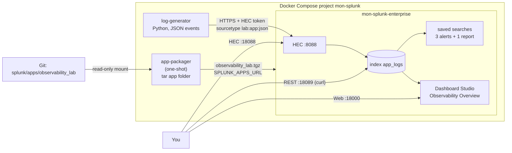

# Project 2: Splunk observability lab with Docker Compose and HEC

## Goal

Run Splunk Enterprise locally and manage its configuration as code:

- **Splunk Enterprise** in Docker, with the HTTP Event Collector (HEC) enabled and a token from `.env`.
- **A log generator** container that sends JSON access events to HEC.
- **A Splunk app** in Git (`observability_lab`) with `indexes.conf`, `props.conf`, `savedsearches.conf`
  (three alerts and one report) and a Dashboard Studio dashboard.
- **Verification by API**: send an event, search for it and list the saved searches with `curl`.

## Architecture



## Prerequisites

- Docker with the Compose plugin (`docker compose version`).
- About **4 GB of free RAM** and 10 GB of disk. The Splunk image is about 4.7 GB.
- Free host ports 18000, 18088 and 18089.
- `curl` and `python3` for the verify script.
- You must read and accept the
  [Splunk General Terms](https://www.splunk.com/en_us/legal/splunk-general-terms.html).
  Without a license file, Splunk Enterprise runs on a **60-day trial license** (500 MB/day of indexing).

## Files

| Path | What it does |
| --- | --- |
| `docker-compose.yml` | `app-packager`, `splunk` and `log-generator`. Container names start with `mon-splunk-`. |
| `.env.example` | Admin password, HEC token, license acceptance and generator settings. Copy to `.env` (git-ignored). |
| `log-generator/` | Python (standard library only) script and Dockerfile. Sends batches of events to HEC. |
| `splunk/apps/observability_lab/default/app.conf` | App name, version and label. |
| `.../default/indexes.conf` | Index `app_logs`: 30-day retention, 1 GB size cap. |
| `.../default/props.conf` | Sourcetype `lab:app:json`: JSON field extraction plus `is_error` and `status_class` fields. |
| `.../default/savedsearches.conf` | Alerts: 5xx error rate, p95 latency, no events received. One report: errors by endpoint. |
| `.../default/data/ui/views/observability_overview.xml` | Dashboard Studio dashboard (KPIs, time charts, top failing endpoints). |
| `.../default/data/ui/nav/default.xml` | App navigation. The dashboard is the app's home page. |
| `.../metadata/default.meta` | Permissions. Read for everyone, write for admin. Props are shared with all apps. |
| `scripts/verify.sh` | End-to-end check through HEC and the REST API. |

## How the app gets into Splunk

The app folder is the source of truth. On every `docker compose up`, the `app-packager` job packs it into
`observability_lab.tgz` on a shared volume. The Splunk image installs it from `SPLUNK_APPS_URL` during startup.

Why not mount the folder straight into `/opt/splunk/etc/apps`? The image's startup playbook changes the owner of
everything under `/opt/splunk`. A read-only mount makes that step fail. A read-write mount would change the owner
of your Git files on the host. A packaged app is also how apps are deployed to real Splunk servers.

## Usage

### 1. Create `.env`

```bash
cd project2-splunk-docker-observability
cp .env.example .env
```

Edit `.env`:

- `SPLUNK_PASSWORD`: at least 8 characters.
- `SPLUNK_HEC_TOKEN`: a new GUID, for example from `uuidgen`.
- Keep `SPLUNK_START_ARGS` and `SPLUNK_GENERAL_TERMS` only if you accept the Splunk license and General Terms.

### 2. Start the stack

```bash
docker compose up -d --build
```

Splunk takes 1–5 minutes to start. The log generator waits until Splunk is healthy. Follow the progress:

```bash
docker compose ps
docker logs -f mon-splunk-enterprise   # wait for "Ansible playbook complete"
```

### 3. Open Splunk Web

Go to <http://localhost:18000> and log in as `admin` with `SPLUNK_PASSWORD`.
Open the **Observability Lab** app. Its home page is the **Observability Overview** dashboard.

### 4. Search the events

In Splunk Web, or with the REST API:

```bash
set -a; . ./.env; set +a
curl -sk -u "admin:${SPLUNK_PASSWORD}" https://localhost:18089/services/search/jobs/export \
  -d output_mode=json -d earliest_time=-15m \
  --data-urlencode 'search=search index=app_logs sourcetype="lab:app:json" | stats count BY service, status'
```

### 5. Make the alerts fire

Raise the error rate and latency, then recreate only the generator:

```bash
ERROR_RATE=0.3 LATENCY_MS=1500 docker compose up -d log-generator
```

The alerts run every 5 minutes. After the next run, check **Activity → Triggered Alerts** in Splunk Web, or:

```bash
curl -sk -u "admin:${SPLUNK_PASSWORD}" \
  "https://localhost:18089/servicesNS/-/observability_lab/alerts/fired_alerts?output_mode=json" |
  python3 -c 'import json,sys; [print(e["name"], e["content"]["triggered_alert_count"]) for e in json.load(sys.stdin)["entry"]]'
```

Go back to normal with `docker compose up -d log-generator` (values from `.env`).

### Change the app

Edit files under `splunk/apps/observability_lab/`, then recreate Splunk. The packager runs again first:

```bash
docker compose up -d --force-recreate splunk
```

Changes made in Splunk Web are saved in `local/` inside the container, not in Git. Copy them back into `default/`
if you want to keep them.

### Add a real alert action (optional)

The alerts only use **Triggered Alerts** (`alert.track = 1`), because email, Slack or webhooks need credentials.
To add a webhook, put these lines under an alert in a `local/savedsearches.conf` that is not committed:

```ini
action.webhook = 1
action.webhook.param.url = https://hooks.example.com/your-endpoint
```

## How to verify

```bash
./scripts/verify.sh
```

The script:

1. Checks HEC health on port 18088.
2. Sends one test event through HEC and searches for it until it appears.
3. Prints event, error and p95 counts per service.
4. Lists the app's saved searches and dashboards, and any triggered alerts.

## Clean up

```bash
docker compose down -v
docker image rm mon-splunk-log-generator:local
# optional, frees about 4.7 GB:
docker image rm splunk/splunk:10.6.0
```

## Troubleshooting

| Problem | Likely cause and fix |
| --- | --- |
| Splunk exits with "License not accepted" | `SPLUNK_START_ARGS` or `SPLUNK_GENERAL_TERMS` is missing in `.env`. |
| Splunk stays `health: starting` for a long time | First start is slow on small machines. Check `docker logs mon-splunk-enterprise`. Give Docker at least 4 GB RAM. |
| Generator logs `HEC rejected batch: 403` | The generator and Splunk use different tokens. Check `SPLUNK_HEC_TOKEN` in `.env`, then run `docker compose down -v` and start again. |
| Generator logs `HEC rejected batch: 400 ... Incorrect index` | The `app_logs` index does not exist. Check that the app was installed: `docker logs mon-splunk-app-packager` should print `packaged`. |
| Search returns nothing | Use a longer time range, and check `index=app_logs`. HEC events need a few seconds to be searchable. |
| `fired_alerts` is empty | The alerts run on the 5-minute mark and need at least 20 events per service in the window. Wait for the next run. |
| `curl: (60) SSL certificate problem` | The lab uses a self-signed certificate. The examples use `-k`. Do not use `-k` with real servers. |

## Tested

What was run locally on 2026-10-02 (Linux, Docker 29, Compose v5, image `splunk/splunk:10.6.0`):

- `docker compose config`: valid. `python3 -m py_compile` on the generator: OK. `shellcheck scripts/verify.sh`: clean.
- `docker compose up -d --build`: the packager printed `packaged`, Splunk became healthy in about 1 minute, and the
  generator connected to HEC.
- REST API checks: app `observability_lab` 1.0.0 installed and enabled. Index `app_logs` exists with
  `frozenTimePeriodInSecs=2592000` and `maxTotalDataSizeMB=1024`. HEC health returned `HEC is healthy`.
- Search via `/services/search/jobs/export`: events for all three services, with the `is_error`, `status_class` and
  `response_time_ms` fields from `props.conf`.
- `scripts/verify.sh`: the test event sent through HEC on port 18088 was found by search. The 3 scheduled alerts,
  the report and the Dashboard Studio view were listed.
- Every dashboard data source query was run through the REST API without errors.
- Alert test: with `ERROR_RATE=0.3 LATENCY_MS=1500`, the 17:45 UTC scheduler run returned 3 rows (one per service)
  for both **Lab - High 5xx error rate** and **Lab - p95 latency above 800 ms**. Both appeared in `fired_alerts`.
  The scheduler log (`index=_internal sourcetype=scheduler`) showed `status=success` for all three alerts.
- **Lab - No events received**: with the generator stopped, its search returned one row (`count=0`), so it would
  trigger. With traffic flowing, it returned no rows.
- `docker compose down -v`: removed all containers, volumes and the network. The generator image was removed.

Not tested:

- The dashboard was not opened in a browser. Its definition was checked as valid JSON, Splunk accepted it as a
  version 2 view, and all its queries ran without errors.
- No universal forwarder, no TLS certificate validation, no real alert actions (email, Slack, webhook).
- Not tested on Splunk Cloud. There, apps go through app vetting, and indexes are usually created with the
  Admin Config Service (ACS) instead of `indexes.conf`.

## Interview talking points

- **HEC vs universal forwarder.** HEC is simple for apps and serverless code: HTTPS plus a token, no agent. A
  universal forwarder is better for log files on hosts: it buffers on disk, retries and load-balances across
  indexers. Here HEC keeps the lab small. A forwarder container would be the next step.
- **Config as code.** Indexes, sourcetypes, alerts and dashboards live in one app in Git, in `default/`. Splunk Web
  changes go to `local/`, so the Git version stays the baseline and drift is easy to spot.
- **Search-time vs index-time.** `KV_MODE = json` and `EVAL-` fields are search-time. They cost nothing at ingest
  and can be changed later. Index-time extractions are faster to search but are fixed once indexed and use more disk.
- **Alerts that do not spam.** Each alert has a minimum event count (`count >= 20`), runs every 5 minutes and is
  throttled per service for 30 minutes (`alert.suppress.fields = service`). The "no events received" alert catches a
  broken pipeline, which a threshold alert alone would miss.
- **License and cost.** The trial allows 500 MB/day. The index has a size cap and 30-day retention, so the lab cannot
  fill the disk. In production, ingest volume is the main Splunk cost, so filtering noisy events before indexing matters.
