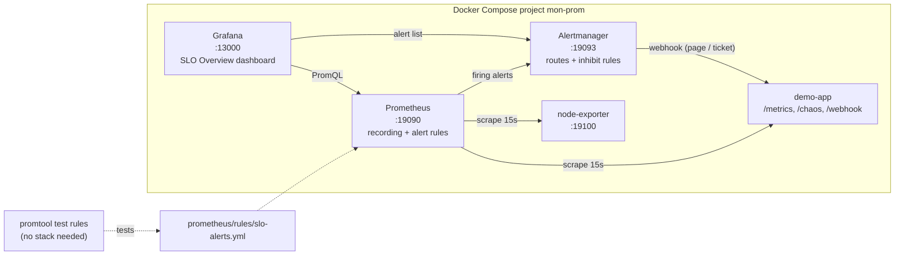

# Project 3: Prometheus SLO alerting with rule unit tests

## Goal

Show how to treat alert rules like code:

- **SLO-style alert rules**: multi-window, multi-burn-rate error-rate alerts, p95 latency, instance down and disk filling.
- **Unit tests** for every alert with `promtool test rules`. The tests run in seconds and need no running stack.
- **A local stack** with Docker Compose: Prometheus, Alertmanager, Grafana (provisioned data source and dashboard),
  node-exporter, and a small demo app that you can break on purpose to make alerts fire.

## Architecture



## Prerequisites

- Docker with the Compose plugin (`docker compose version`).
- `make` and `curl` (optional, for the shortcuts and the verify script).
- Free host ports 19090, 19093, 13000 and 19100.

You do **not** need to install `promtool` or `amtool`. The Makefile runs them from the official images.

## Files

| Path | What it does |
| --- | --- |
| `docker-compose.yml` | The five services. Container names start with `mon-prom-`. |
| `prometheus/prometheus.yml` | Scrape jobs and the Alertmanager target. |
| `prometheus/rules/slo-alerts.yml` | Recording rules and the six alerts. |
| `prometheus/tests/slo-alerts.test.yml` | `promtool` unit tests for the recording rules and every alert. |
| `alertmanager/alertmanager.yml` | Routing by `severity` (page / ticket), grouping and inhibit rules. |
| `grafana/provisioning/` | Provisions the Prometheus and Alertmanager data sources and the dashboard folder. |
| `grafana/dashboards/slo-overview.json` | The **SLO Overview** dashboard. |
| `demo-app/` | Python (standard library only) service that simulates traffic and receives webhooks. |
| `scripts/verify.sh` | Checks every endpoint, the scrape targets, the loaded rules and the alerts. |
| `Makefile` | `check`, `test`, `up`, `verify`, `down`. |
| `.env.example` | Grafana admin user and password. Copy it to `.env` (git-ignored). |

## The alerts

The availability SLO is **99.5%** of requests without a 5xx error, so the error budget is 0.5%.
The latency SLO is **p95 below 500 ms**.

| Alert | Condition | for | Severity |
| --- | --- | --- | --- |
| `HighErrorRateFastBurn` | 5xx ratio > 14.4 × 0.5% (7.2%) over **both** 1h and 5m | 2m | page |
| `HighErrorRateSlowBurn` | 5xx ratio > 6 × 0.5% (3%) over **both** 6h and 30m | 15m | ticket |
| `HighLatencyP95` | p95 latency over 5m > 500 ms | 10m | ticket |
| `InstanceDown` | `up == 0` | 2m | page |
| `DiskWillFillIn4Hours` | less than 20% free **and** the 1h trend reaches 0 within 4h | 15m | page |
| `DiskSpaceLow` | less than 10% free | 10m | ticket |

The two windows in each burn-rate alert work together. The long window proves the problem is big enough to matter.
The short window makes the alert stop soon after the problem is fixed.

## Usage

### 1. Run the rule unit tests (no stack needed)

```bash
cd project3-prometheus-alerting
make check   # promtool check config/rules + amtool check-config + routing tests
make test    # promtool test rules
```

Or with local binaries:

```bash
promtool check rules prometheus/rules/slo-alerts.yml
promtool test rules prometheus/tests/slo-alerts.test.yml
```

### 2. Start the stack

```bash
cp .env.example .env      # then change GRAFANA_ADMIN_PASSWORD
docker compose up -d --build
docker compose ps         # all services should become "healthy"
```

### 3. Open the UIs

| UI | URL |
| --- | --- |
| Prometheus | <http://localhost:19090> (see **Alerts** and **Status → Targets**) |
| Alertmanager | <http://localhost:19093> |
| Grafana | <http://localhost:13000> (log in with the user and password from `.env`) |

The **SLO Overview** dashboard is the Grafana home page. It is also in the **SLO Lab** folder.

### 4. Make alerts fire on purpose

Raise the error rate to 50% and latency to 900 ms:

```bash
docker exec mon-prom-demo-app python -c "import urllib.request as u; print(u.urlopen(u.Request('http://localhost:8080/chaos?error_rate=0.5&latency_ms=900', method='POST')).read().decode())"
```

After about 3 minutes `HighErrorRateFastBurn` fires. After about 11 minutes `HighLatencyP95` fires too.
Stop node-exporter to see `InstanceDown` after about 2 minutes:

```bash
docker stop mon-prom-node-exporter
```

Alertmanager sends each notification to the demo app webhook. Watch them arrive:

```bash
docker logs -f mon-prom-demo-app | grep ALERT
```

Put things back to normal:

```bash
docker start mon-prom-node-exporter
docker exec mon-prom-demo-app python -c "import urllib.request as u; print(u.urlopen(u.Request('http://localhost:8080/chaos?error_rate=0.01&latency_ms=120', method='POST')).read().decode())"
```

## How to verify

```bash
./scripts/verify.sh
```

Expected: four `OK` lines, all four targets `up`, and the six alert rules listed. When nothing is broken, the
alert rules are `inactive` and Alertmanager has `0 alert(s)`.

## Clean up

```bash
docker compose down -v
docker image rm mon-prom-demo-app:local
```

## Troubleshooting

| Problem | Likely cause and fix |
| --- | --- |
| `GRAFANA_ADMIN_PASSWORD` error on `docker compose up` | `.env` is missing. Run `cp .env.example .env`. |
| `port is already allocated` | Another process uses 19090, 19093, 13000 or 19100. Stop it or change the left side of the port mapping. |
| A rule test fails with `got: 9.999999999999999E-02` | Float noise. The test file uses `fuzzy_compare: true`, and the p95 test wraps the value in `round()`. |
| Rule changes do not show up | Reload Prometheus: `curl -X POST http://localhost:19090/-/reload`. |
| Grafana shows "No data" | Check **Status → Targets** in Prometheus. The `demo-app` target must be `up`. |
| node-exporter disk numbers look wrong on macOS/Windows | Docker Desktop runs in a VM, so node-exporter sees the VM disk, not your laptop disk. |

## Tested

What was run locally on 2026-10-02 (Linux, Docker 29, Compose v5):

- `promtool check rules` (promtool 3.15.0): 12 rules found, success.
- `promtool test rules prometheus/tests/slo-alerts.test.yml`: **SUCCESS** (10 test groups, positive and negative cases).
  A mutation check (raising the fast-burn threshold and shortening `for`) made the tests fail as expected.
- `promtool check config --syntax-only prometheus/prometheus.yml`: success.
- `amtool check-config` (0.34.1): success. `amtool config routes test`: `severity=page` → `pager-webhook`,
  `severity=ticket` → `ticket-webhook`, anything else → `default-webhook`.
- `make check` and `make test` (tools from the Docker images): success.
- `docker compose up -d --build`: all 5 containers healthy. `scripts/verify.sh`: all checks OK, 4/4 targets up,
  6 alert rules loaded. Grafana API: both data sources provisioned, Prometheus data source health OK,
  **SLO Overview** dashboard in the **SLO Lab** folder. Every dashboard panel query returned data from Prometheus.
- End to end: with `/chaos` at 50% errors and 900 ms, `HighErrorRateFastBurn` and `HighLatencyP95` fired.
  `HighErrorRateSlowBurn` also fired, because with only minutes of history the 6h window equals the short window.
  With node-exporter stopped, `InstanceDown` fired. The demo app logged the webhook notifications from Alertmanager,
  and an `ALERT resolved: InstanceDown` message after node-exporter was started again.
- Inhibition, live: after a config reload, the Alertmanager API showed `HighErrorRateSlowBurn` as `suppressed`
  (inhibited by `HighErrorRateFastBurn`).
- `docker compose down -v` removed all containers, volumes and the network. The demo image was removed.

Not tested:

- Real notification channels (Slack, email, PagerDuty). They need credentials. Only the webhook receiver was used.
- The `InstanceDown` inhibit rule was validated by `amtool check-config` only. It is hard to show live here,
  because the demo app is both the target and the webhook receiver.
- `DiskWillFillIn4Hours` and `DiskSpaceLow` were proven by the unit tests only. They need a filling disk to fire live.

## Interview talking points

- **Burn-rate alerts instead of a fixed threshold.** A plain "error rate > 5%" alert is noisy for short spikes and slow
  for long low-level problems. Two burn rates with two windows each page fast for big outages and open a ticket for a
  slow leak. The unit test "fast burn ignores a 2-minute spike" shows the long window stopping a false page.
- **Recording rules.** The ratios are pre-computed as `job:http_errors:ratio_rate5m` and so on. Alerts and
  dashboards share the same numbers, and the alert expressions stay short and cheap.
- **Alerts are code, so they get tests.** `promtool test rules` runs in CI in seconds. Each alert has a firing case
  and a quiet case, so a wrong threshold or a typo in a label fails the build, not the on-call night.
- **Severity drives routing.** Rules only set `severity: page` or `ticket`. Alertmanager decides where that goes, and
  inhibit rules stop duplicate noise: an `InstanceDown` hides the error-rate and latency alerts for the same job, and
  a fast-burn page hides the slow-burn ticket.
- **Trade-offs.** Disk prediction uses `predict_linear` on 1h of data, which can be fooled by a big one-off write.
  The "less than 20% free" guard and `for: 15m` reduce that risk. The demo keeps 7 days of data with no remote
  storage. For production I would add remote write (for example Thanos or Azure Monitor managed Prometheus).
